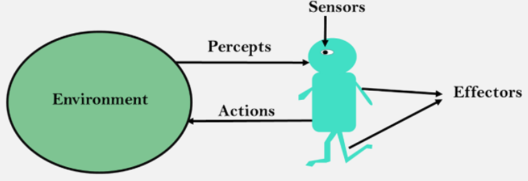

## What is a agent?

A agent is anything, that percives and acts.

* A agent perveives the environment through sensors (-> Percepts)
* A agent acts upon the environment through actuators (-> Actions)

#### Examples:

* Human-Agent: A human agent has eyes, ears, and other organs which for for sensors and hand, legs, arms work for actuators.

* Robotic-Agent: A robotic agent can have cameras, infrared range finder for sensors and motors as actuators.

* Software-Agent: Software agent can have keystrokes, file contents as sensors and act upon this inputs, output via displaying results on screen.