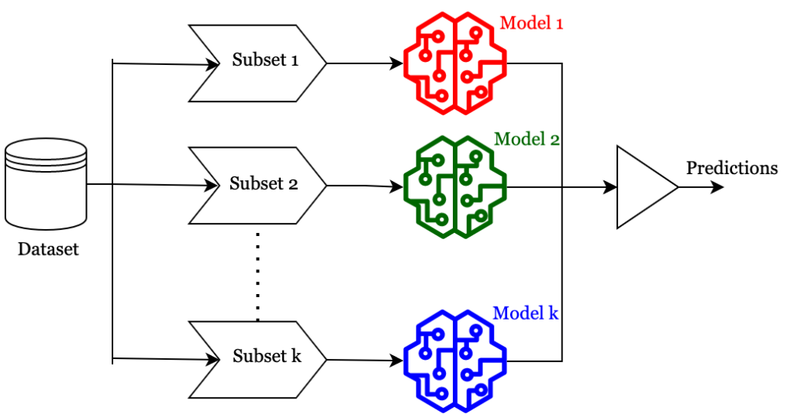

# Ensembles

## Motivation: Ensembles are aggregations of multiple base models

# Variance Reduction

The Bias-Variance Decomposition:

$$
\mathbb{E}_{x, y, \mathcal{D}} \left[ (\hat{f}(x; \mathcal{D}) - y)^2 \right] =
\underbrace{\mathbb{E}_{x, \mathcal{D}} \left[ (\hat{f}(x; \mathcal{D}) - \bar{f}(x))^2 \right]}_{\text{Variance}}
+ \underbrace{\mathbb{E}_{x, y} \left[ (\bar{f}(x) - \bar{y}(x))^2 \right]}_{\text{Bias}^2}
+ \underbrace{\mathbb{E}_{x, y} \left[ (\bar{y}(x) - y)^2 \right]}_{\text{Noise}}
$$

where the expected prediction model \( \bar{f}(x) \) is defined as:

$$
\bar{f}(x) \coloneqq \mathbb{E}_{\mathcal{D} \sim P_N} \left[ \hat{f}(x; \mathcal{D}) \right] = \int_{\mathcal{D}} \hat{f}(x; \mathcal{D}) \, p(\mathcal{D}) \, d\mathcal{D}
$$

Therefore, variance is reduced if:

$$
\hat{f}(x; \mathcal{D}) \to \bar{f}(x), \, \forall \mathcal{D}
$$

# Ensemble of Multiple I.I.D. Training Sets

- Given multiple (i.i.d.) training sets \( \mathcal{D}^{(1)}, \dots, \mathcal{D}^{(K)} \), where:

$$
\mathcal{D}^{(k)} \in (\mathcal{X} \times \mathcal{Y})^N, \, \forall k \in \{1, \dots, K\}
$$

- Train one prediction model on each training set:

$$
\hat{f}^{(k)}(x) = \hat{f}(x, \theta^{(k)}), \, \text{s.t.} \, \theta^{(k)} = \arg \min_{\theta} \frac{1}{N} \sum_{i=1}^N \mathcal{L}\left(y_i^{(k)}, \hat{f}(x_i^{(k)}, \theta)\right)^2
$$

- Compute an ensemble model:

$$
\hat{f}(x) = \frac{1}{K} \sum_{k=1}^K \hat{f}^{(k)}(x)
$$

---

### Ensemble Reduces Variance

- Following the law of large numbers:

$$
\bar{z} = \frac{z_1 + z_2 + \dots + z_K}{K} \to \mathbb{E}[z] \, \text{as} \, K \to \infty
$$

- For the ensemble model:

$$
\left[ \hat{f}(x) = \frac{1}{K} \sum_{k=1}^K \hat{f}^{(k)}(x) \right] \to \left[ \bar{f}(x) \coloneqq \mathbb{E}_{\mathcal{D} \sim P_N} [\hat{f}(x; \mathcal{D})] \right]
$$

- Replacing the single model with an averaged ensemble reduces the variance:

$$
\mathbb{E}_{x, \mathcal{D}} \left[ (\hat{f}(x; \mathcal{D}) - \bar{f}(x))^2 \right] = \mathbb{E}_x \left[ (\hat{f}(x) - \bar{f}(x))^2 \right] \to 0 \, \text{as} \, K \to \infty
$$

# Bagging

## Bootstrap Aggregation (Bagging)

- Sample $ \mathcal{D}^{(1)}, \dots, \mathcal{D}^{(K)} $ with replacement from $ \mathcal{D}^{\text{Train}} \in (\mathcal{X} \times \mathcal{Y})^N $ .
- The distribution of sampling one instance \( I \) is:

$$
P((x, y) \mid \mathcal{D}^{\text{Train}}) = \frac{1}{N}.
$$

- Sample a bootstrap $\mathcal{D}^{(k)} \sim I^n $ with replacement, where $ n = |\mathcal{D}^{(k)}|$  and  $n \leq N $.

- Train one model per bootstrap and aggregate an ensemble:

$$
\hat{f}(x) = \frac{1}{K} \sum_{k=1}^K \hat{f}^{(k)}(x).
$$

- Notice that \( \mathcal{D}^{(k)}, \forall k \) are **not i.i.d.** since they share instances:

$$
\hat{f}(x) \not\to \bar{f}, \, \mathbb{E}_x \left[ (\hat{f}(x) - \bar{f}(x))^2 \right] \not\to 0.
$$

---

## Bagging Requires Uncorrelated Models

- Models make errors $ \epsilon_k$  for  k = 1 $ \dots, K $ in a regression task.

- Assume $ \epsilon_k $ is drawn from a multivariate normal distribution with mean  0 , variance $ \mathbb{E}[\epsilon_k^2] = v $, and covariances $ \mathbb{E}[\epsilon_k \epsilon_l] = c $.

- The overall error of the ensemble is:

$$
\frac{1}{K} \sum_{k=1}^K \epsilon_k.
$$

- The expected squared error of the ensemble is:

$$
\mathbb{E} \left[ \left( \frac{1}{K} \sum_{k=1}^K \epsilon_k \right)^2 \right] =
\frac{1}{K^2} \mathbb{E} \left[ \sum_{k=1}^K \left( \epsilon_k^2 + \sum_{k \ne l} \epsilon_k \epsilon_l \right) \right].
$$

Expanding:

$$
\mathbb{E} \left[ \left( \frac{1}{K} \sum_{k=1}^K \epsilon_k \right)^2 \right] =
\frac{1}{K} v + \frac{K-1}{K} c.
$$

---

### Two Cases:

1. **If errors are correlated** (\( c = v \)):

$$
\text{Squared error} = v.
$$

2. **If errors are uncorrelated** (\( c = 0 \)):

$$
\text{Squared error} = \frac{v}{K}.
$$

- In **(A)**, where errors are correlated, the ensemble does not help.

- In **(B)**, where errors are uncorrelated, the error is reduced **linearly** with \( K \).

# Boosting