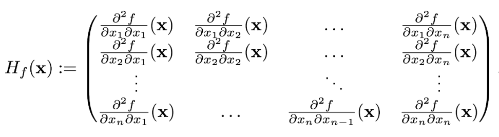
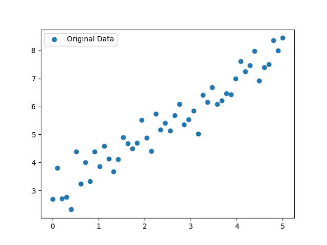
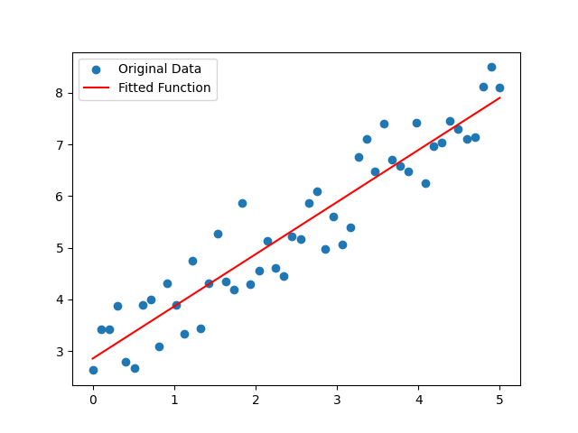
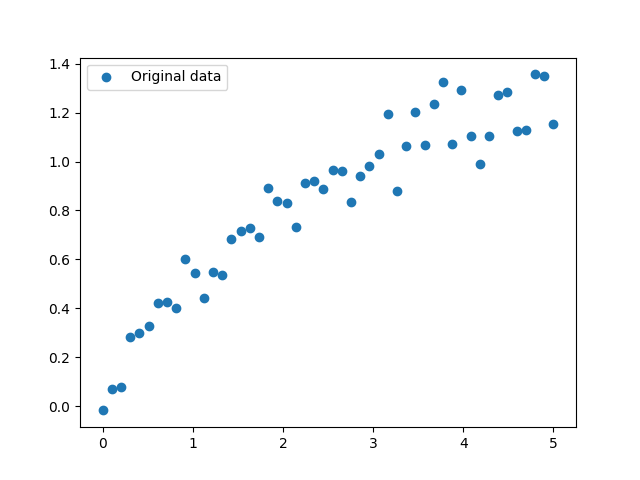

# some-optimization-algorithms

## Algorithms
- Gradient descent
- Gauss-Newton algorithm
- Conjugate gradient method

### Gradient descent
Gradient descent is an iterativ Algorithm to find a local optimum (minimum) of a differentiable multivariate function.

Let $f \in C^{1}$ (at least one time differentiable). The gradient of f, f' = grad f = ($\displaystyle \frac{\partial f}{\partial x_{1}}$, $\displaystyle \frac{\partial f}{\partial x_{2}}$, ..., $\displaystyle \frac{\partial f}{\partial x_{n}}$)^T (T for transpose).

#### Iterative Method

$x^{k + 1}$ = $x^{k}$ - $\tau^{k}$ grad f($x^{k}$)

with an startvalue $x^{0}$.

The stepsize $\tau^{k}$ should be chosen optimal, that the following condition is satisfied:

f($x^k$ - $\tau^k$ grad f($x^k$) $\leq$ f($x^k$ - $\epsilon$ grad f($x^k$) $\forall$ $\epsilon$ $\geq$ 0

#### Wolfe conditions to find the best $\tau$

#### Armijo rule and backtracking line search

f($x^k$ - $\tau^k$ grad f($x^k$) - f($x^k$) $\leq$ $\delta$ $\tau$ grad f($x^k$)^T (- grad f($x^k$)

with $\delta \in (0, 1)$ and usually $\delta$ = 10e-4.

##### Example:

```python
beta = 0.9
delta = 10e-4
while f(x_k - tau * f_grad(x_k)) - f(x_k) > delta * tau * f_grad(x_k).T * (-f_grad(x_k)):
  tau = beta * tau
```

With this knowledge, we are ready, to implement the full gradient descent algorithm (with line search).

```python
for _ in range(max_iterations):
    tau = 1
    while f(x_k - tau * f_grad(x_k)) - f(x_k) > delta * tau * f_grad(x_k).T * (-f_grad(x_k)):
        tau = beta * tau
    x_k = x_k - tau * f_grad(x_k)
```

### Newtons method
Newtons method is and iterativ Algorithm (like Gradient descent) to find a local optimum. It incorporates not only the first derivative but also the second derivative in its calculations.

Let $f \in C^{2}$ (at least two times differentiable). The gradient of f, f' = grad f = ($\displaystyle \frac{\partial f}{\partial x_{1}}$, $\displaystyle \frac{\partial f}{\partial x_{2}}$, ..., $\displaystyle \frac{\partial f}{\partial x_{n}}$)^T (T for transpose).
In the multidimensional case the second derivative f'', is given by the Hessian matrix. f'' = $H_{f}$.

<p float="left">
   
</p>

#### Iterative Method

$x^{k + 1}$ = $x^{k}$ - $\tau^{k}$ $H_{f}^{-1}$ grad f($x^{k}$)

Note: We use the inverse of the Hessian Matrix. We can use Armijo- and Wolfe-Conditions, to make the algorithm more efficient.


### Gauss Newton method

The Gauss–Newton algorithm is used to solve non-linear least squares problems, which is equivalent to minimizing a sum of squared function values.

#### Example Algorithm with a linear problem.

```python
m_b = np.array([m0, b0])
for _ in range(max_iter):
    jac = jacobian(x, m_b[0], m_b[1])
    loss = f_loss(x, m_b[0], m_b[1], y)
    new_m_b = m_b + np.linalg.inv(jac.T@jac)@jac.T@loss
    if np.linalg.norm(m_b - new_m_b) < tol:
        break
return new_m_b
```

#### Examples

<p float="left">
   
   
</p>
  
<p float="left">
   
   
</p>
 

